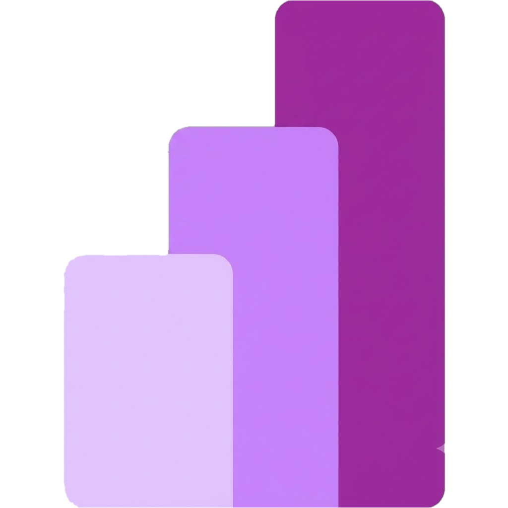
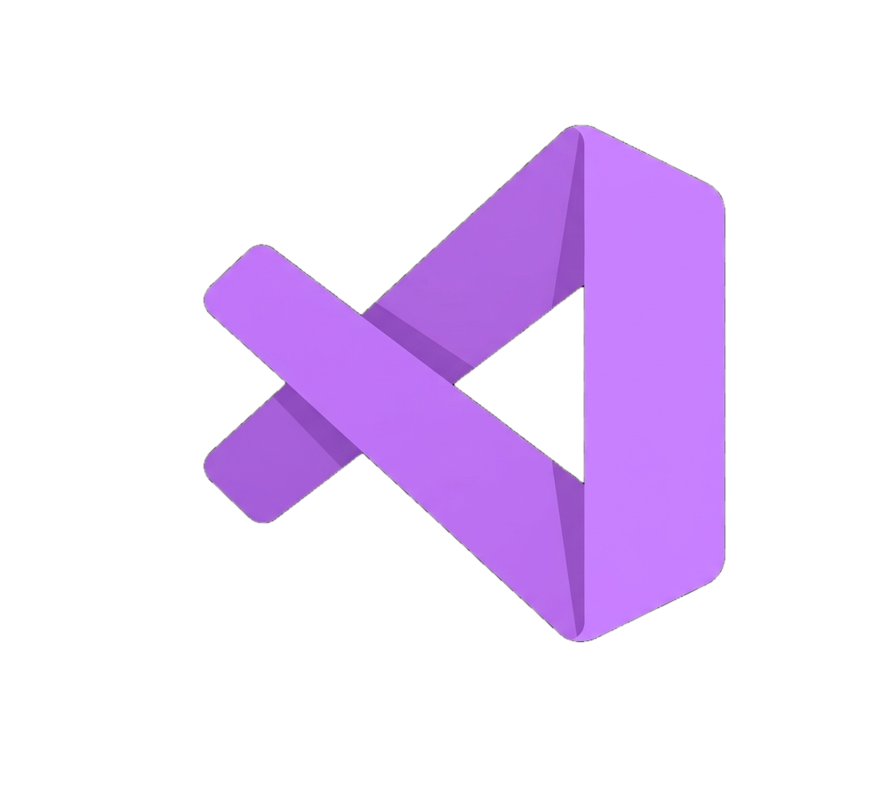

<!--
  ================================================================
  README de perfil do GitHub — tema neon roxo/rosa pixelado
  ================================================================
-->

<!-- CAPA -->

  

---

<table>
<tr>
<td width="70%" valign="middle">

## ✨ Sobre mim
### Oie, eu sou a Maria Gabriela! 

Sou Engenheira Química e estudante de ADS.

Sempre gostei de simplificar processos - de planilhas de laboratório a relatórios de produção - e foi assim que fui parar na automação e nos dados. Hoje trabalho no dia a dia com Python, SQL e automações, enquanto aprofundo meus estudos em Machine Learning, IA e computação em nuvem.

Aqui no GitHub guardo os projetos e estudos dessa transição de carreira.

</td>
<td width="40%">

</td>
</tr>
</table>

---

## Tech Stack
<table align="center">

  <tr align="center">
    <td> Python</td>
    <td> Java</td>
    <td> SQLite</td>
    <td> PostgreSQL</td>
    <td> Power BI</td>
    <td> Looker Studio</td>
    <td> Power Automate</td>
    <td> n8n</td>
  </tr>

  <tr align="center">
    <td> Git</td>
    <td> GitHub</td>
    <td> VS Code</td>
    <td> IntelliJ</td>
    <td> Linux</td>
    <td> Docker<i>(aprendendo)</i></td>
    <td> Cloud<i>(aprendendo)</i></td>
    <td> IA Generator <i>(aprendendo)</i></td>
  </tr>
</table>
---

## Projetos em destaque

<table>
<tr>
<td width="30%">

</td>
<td width="80%">

**💳 Credit Score — Análise de Risco de Crédito**
Pipeline de dados em Python, análise estatística para avaliação de risco de crédito, com dashboard em Power BI e alertas em Power Automate.
🔗 [Ver](https://github.com/mgabrielamnts/Credit-Score-data-girls)

**🛒 Previsão de Demanda — E-commerce (ML)**
Modelo de Machine Learning para previsão de comportamento de compra.
🔗 [Ver](https://github.com/mgabrielamnts/previsao-vendas-ecommerce)

**🧠 Saúde Mental — Análise Estatística**
Análise estatística de dados de redes sociais e saúde mental.
🔗 [Ver](https://github.com/mgabrielamnts/analise-redes-sociais-saude-mental)

</td>
</tr>
</table>

---

## Vamos conectar?

<!-- GIF -->

  

  
  

